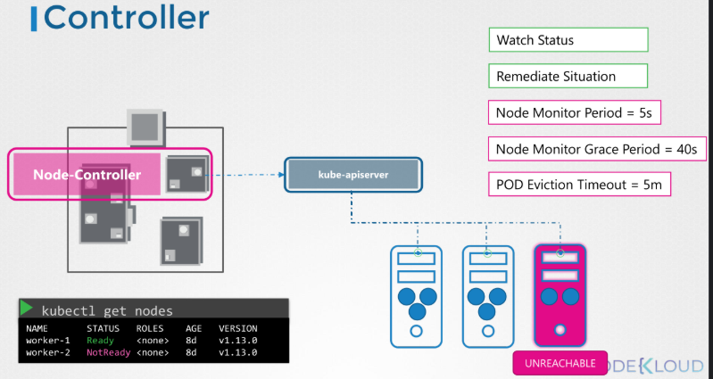

El **kube-controller-manager** es un componente del control plane de Kubernetes encargado de **mantener el estado deseado del cluster**.

Su función principal es:

> Detectar diferencias entre el estado actual y el estado deseado, y actuar para corregirlas.

# ¿Cómo funciona?

El controller-manager ejecuta múltiples **controllers**, cada uno con una responsabilidad específica.

Todos siguen el mismo patrón:

1. Observan el estado (desde el kube-apiserver)
2. Comparan estado actual vs deseado
3. Actúan si hay diferencias

Este patrón se llama --\> **reconciliation loop**

# Controllers importantes

Algunos ejemplos:

* **Node Controller** --\> gestiona el estado de los nodos
* **Replication Controller** --\> asegura número de pods
* **Deployment Controller** --\> gestiona despliegues
* **Endpoint Controller** --\> actualiza endpoints

## Ejemplo de un controller --\> Node Controller

El **Node Controller** es un controlador dentro del **kube-controller-manager** que se encarga de **monitorizar el estado de los nodos del cluster** y reaccionar cuando alguno falla.

Este ejemplo muestra cómo Kubernetes detecta fallos en nodos.

## 1\. El kubelet reporta estado

Cada nodo envía información periódicamente al kube-apiserver:

* estado (Ready / NotReady)
* latidos (heartbeats)

## 2\. El Node Controller observa

El Node Controller (dentro del controller-manager):

* monitoriza los nodos continuamente
* consulta al kube-apiserver

## 3\. Node Monitor Grace Period (\~40s)

Si un nodo deja de reportar durante un tiempo (40 segundos por defecto)

El controller considera:

* el nodo podría estar caído

## 4\. Nodo marcado como NotReady

El Node Controller actualiza el estado del nodo:

* pasa de Ready --\> NotReady

Esto se guarda en etcd vía kube-apiserver

## 5\. Pod Eviction Timeout (\~5 minutos)

Si el nodo sigue sin responder:

tras \~5 minutos:

* los pods se consideran perdidos

## 6\. Reprogramación de Pods

Otros controllers (como ReplicaSet):

* detectan que faltan pods
* crean nuevos en otros nodos disponibles