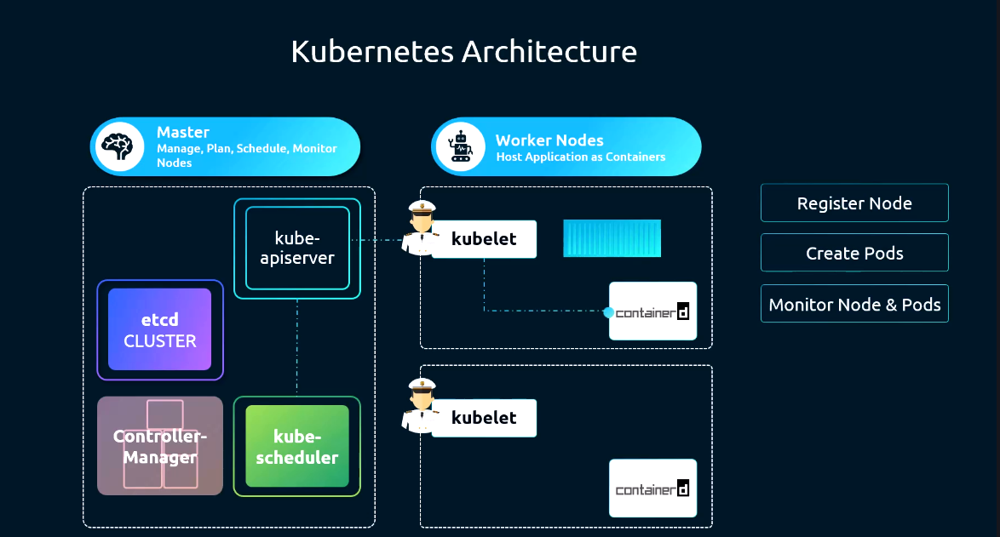

# Kubelet



## ¿Qué es el Kubelet?

El **kubelet** es el agente principal que se ejecuta en cada **nodo worker** del clúster de Kubernetes. Es el responsable de garantizar que los contenedores descritos en los Pods estén corriendo y en buen estado en su nodo.

El kubelet no gestiona contenedores que no hayan sido creados por Kubernetes.

## Funciones principales

### 1. Registro del nodo
Cuando un nodo arranca, el kubelet se registra a sí mismo en el **kube-apiserver**, informando de su existencia y capacidad (CPU, memoria, etc.). De esta forma el clúster es consciente de los recursos disponibles en ese nodo.

### 2. Creación de Pods
El kubelet recibe instrucciones del kube-apiserver (a través de `PodSpecs`) indicando qué Pods deben ejecutarse en su nodo. A partir de esas especificaciones, el kubelet ordena al **container runtime** (por ejemplo, `containerd`) que descargue las imágenes necesarias y arranque los contenedores correspondientes.

### 3. Monitorización del nodo y los Pods
El kubelet monitoriza continuamente el estado del nodo y de los Pods que gestiona, reportando periódicamente esa información de vuelta al kube-apiserver. Si un contenedor falla, el kubelet puede reiniciarlo según la política de reinicio definida en el Pod.

## Flujo de trabajo

```
kube-apiserver  →  kubelet  →  container runtime (containerd)
                                        ↓
                                  contenedores en ejecución
```

1. El kube-apiserver envía un `PodSpec` al kubelet del nodo seleccionado.
2. El kubelet instruye al container runtime para crear los contenedores.
3. El kubelet vigila el estado de los contenedores y reporta al apiserver.

## Instalación

A diferencia de otros componentes del plano de control, el kubelet **no se despliega como un Pod**, sino que se instala y ejecuta directamente como un servicio del sistema operativo en cada nodo worker.