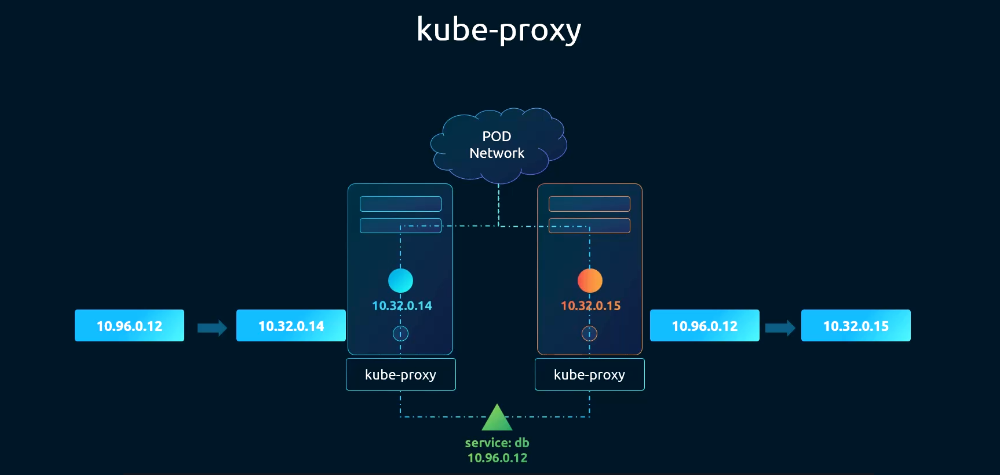

# Kube-Proxy



## ¿Qué es el Kube-Proxy?

El **kube-proxy** es un componente de red que se ejecuta en **cada nodo** del clúster (tanto masters como workers). Su responsabilidad es mantener las reglas de red del nodo para permitir la comunicación hacia los **Services** de Kubernetes.

Cuando se crea un Service, se le asigna una IP virtual (ClusterIP). El kube-proxy es quien se encarga de que el tráfico dirigido a esa IP virtual llegue al Pod correcto, independientemente del nodo en el que esté corriendo.

## Funciones principales

### 1. Gestión de reglas de red
El kube-proxy observa continuamente el kube-apiserver en busca de nuevos Services y Endpoints. Cuando detecta cambios, actualiza las reglas de red del nodo (usando `iptables` o `ipvs`) para reflejar los nuevos destinos.

### 2. Enrutamiento del tráfico
Gracias a las reglas que mantiene, cuando un Pod envía tráfico a la IP de un Service (por ejemplo `10.96.0.12`), el kube-proxy redirige ese tráfico a la IP real del Pod de destino (por ejemplo `10.32.0.14` o `10.32.0.15`), que puede estar en el mismo nodo o en otro nodo distinto.

### 3. Balanceo de carga
Cuando un Service tiene múltiples Pods como destino, el kube-proxy distribuye el tráfico entre ellos, actuando como un balanceador de carga básico a nivel de red.

## Ejemplo de la imagen

La imagen muestra cómo el tráfico hacia el Service `db` con IP `10.96.0.12` es interceptado por el kube-proxy y redirigido al Pod correspondiente:

- Nodo 1: `10.96.0.12` → `10.32.0.14`
- Nodo 2: `10.96.0.12` → `10.32.0.15`

Ambos nodos tienen su propio kube-proxy, y ambos conocen las reglas del Service gracias a la sincronización con el apiserver.

## Modos de funcionamiento

| Modo | Descripción |
|---|---|
| `iptables` | Modo por defecto. Usa reglas de iptables del kernel Linux para redirigir el tráfico |
| `ipvs` | Modo de alto rendimiento. Usa el módulo IPVS del kernel, más eficiente con muchos Services |
| `userspace` | Modo legacy, ya en desuso |

## Despliegue

El kube-proxy se despliega como un **DaemonSet**, lo que garantiza que haya una instancia corriendo en cada nodo del clúster.

```bash
# Ver el DaemonSet del kube-proxy
kubectl get daemonset kube-proxy -n kube-system

# Ver los Pods del kube-proxy
kubectl get pods -n kube-system -l k8s-app=kube-proxy
```
