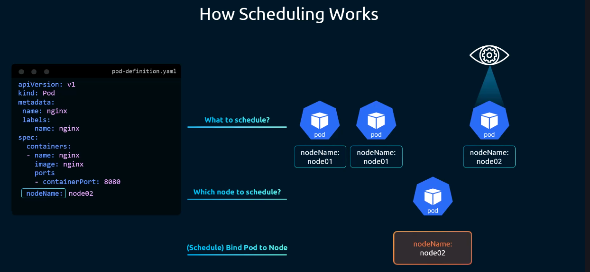

# Kube-Scheduler



## ¿Qué es el Kube-Scheduler?

El **kube-scheduler** es el componente del plano de control responsable de decidir **en qué nodo se ejecutará cada Pod** que aún no tiene nodo asignado. No lanza los Pods directamente, solo toma la decisión de asignación y la comunica al kube-apiserver. Es el kubelet del nodo seleccionado quien finalmente crea los contenedores.

## ¿Cómo funciona?

El proceso de scheduling sigue tres pasos, tal y como muestra la imagen:

### 1. ¿Qué hay que schedulear? (What to schedule?)
El scheduler observa continuamente el kube-apiserver en busca de Pods recién creados que aún no tienen un campo `nodeName` asignado. Esos Pods son candidatos a ser schedulados.

### 2. ¿En qué nodo? (Which node to schedule?)
Para seleccionar el nodo más adecuado, el scheduler aplica dos fases:

- **Filtering (filtrado):** Descarta los nodos que no cumplen los requisitos del Pod (recursos insuficientes, taints, node selectors, etc.). De esta forma pasa de todos los nodos disponibles a un subconjunto de nodos válidos.
- **Scoring (puntuación):** Puntúa los nodos que superaron el filtrado según diferentes criterios (recursos libres, afinidad, etc.) y selecciona el de mayor puntuación.

### 3. Bind Pod → Nodo (Schedule: Bind Pod to Node)
Una vez seleccionado el nodo, el scheduler actualiza el campo `nodeName` en la definición del Pod a través del kube-apiserver. A partir de ese momento, el kubelet del nodo correspondiente detecta el Pod y procede a crearlo.

## Ejemplo de la imagen

El YAML de la imagen define un Pod `nginx` con `nodeName: node02`. Esto ilustra cómo, tras el proceso de scheduling, el campo `nodeName` queda asignado en la definición del Pod:

```yaml
apiVersion: v1
kind: Pod
metadata:
  name: nginx
  labels:
    name: nginx
spec:
  containers:
    - name: nginx
      image: nginx
      ports:
        - containerPort: 8080
  nodeName: node02
```

> Si se especifica `nodeName` manualmente en el YAML, el scheduler es ignorado y el Pod se asigna directamente a ese nodo.

## Asignación manual de nodo

Es posible saltarse el scheduler completamente y forzar que un Pod se ejecute en un nodo concreto. Hay dos formas de hacerlo:

### Opción 1: campo `nodeName` en el YAML (solo en la creación)

Añadiendo el campo `nodeName` directamente en la spec del Pod antes de crearlo:

```yaml
spec:
  nodeName: node02
  containers:
    - name: nginx
      image: nginx
```

> **Limitación:** `nodeName` solo funciona en el momento de la creación del Pod. No se puede modificar en un Pod ya existente.

### Opción 2: Binding mediante la API (Pod ya existente)

Si el Pod ya está creado y se encuentra en estado `Pending`, se puede asignar a un nodo enviando un objeto `Binding` directamente a la API de Kubernetes:

```bash
curl --request POST \
  http://<apiserver>/api/v1/namespaces/default/pods/<pod-name>/binding \
  --header "Content-Type: application/json" \
  --data '{
    "apiVersion": "v1",
    "kind": "Binding",
    "metadata": { "name": "<pod-name>" },
    "target": {
      "apiVersion": "v1",
      "kind": "Node",
      "name": "node02"
    }
  }'
```

Esta es exactamente la operación que realiza el scheduler internamente cuando toma su decisión.

## Criterios de selección de nodo

| Criterio | Descripción |
|---|---|
| Recursos disponibles | CPU y memoria libres en el nodo |
| Taints y Tolerations | Restricciones de nodo que los Pods deben tolerar |
| Node Affinity | Preferencias o requisitos sobre etiquetas del nodo |
| Pod Affinity / Anti-Affinity | Colocalización o separación respecto a otros Pods |
| Node Selector | Selección de nodo por etiquetas específicas |

