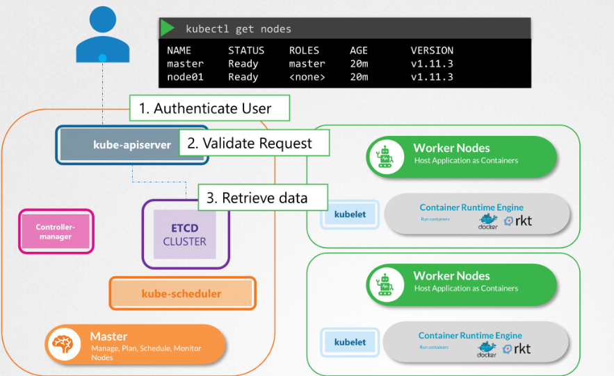
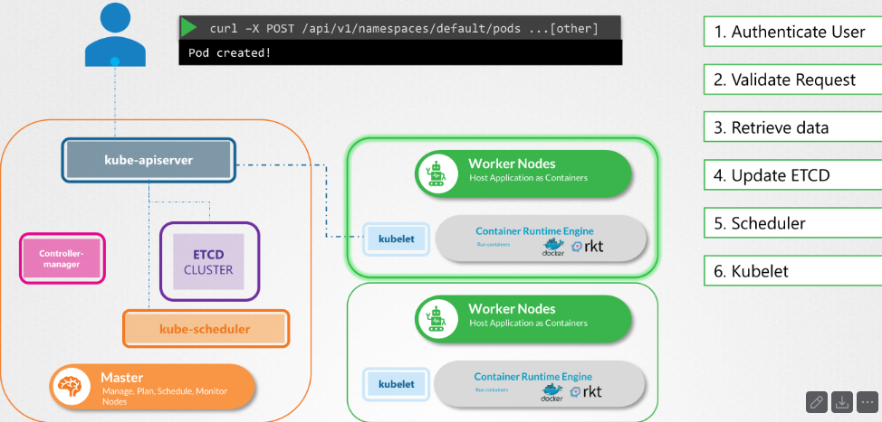

El **kube-apiserver** es el componente central del control plane de Kubernetes.

Es la **puerta de entrada a todo el cluster**.

Todas las operaciones pasan por él:

* kubectl
* APIs REST
* componentes internos (scheduler, controllers)

En otras palabras:

> Es el "cerebro expuesto" de Kubernetes.


# Flujo completo: `kubectl get nodes`

A continuación se explica paso a paso lo que ocurre cuando ejecutas:

```bash
kubectl get nodes
```



## 1\. El cliente hace la petición

* El usuario ejecuta `kubectl get nodes`
* kubectl construye una petición HTTP hacia el kube-apiserver
* Usa el kubeconfig para saber:
  * endpoint
  * credenciales

## 2\. Autenticación

El kube-apiserver verifica **quién eres**.

Métodos posibles:

* Certificados (TLS)
* Tokens
* OIDC

Resultado:

* Usuario autenticado (ej: admin)
* O error (no autorizado)

## 3\. Autorización

Ahora decide **qué puedes hacer**.

Ejemplo:

* ¿Puede este usuario hacer `get nodes`?

Se usan mecanismos como:

* RBAC
* ABAC

Resultado:

* Permitido → sigue el flujo
* Denegado → error

## 4\. Procesamiento de la request

El kube-apiserver entiende que debe obtener información de los nodos.

Aquí decide:

* Consultar estado en etcd

## 5\. Consulta a etcd

El kube-apiserver consulta el cluster de etcd.

* etcd es la base de datos distribuida
* Guarda el estado del cluster

Busca:

* objetos tipo Node

## 6\. Respuesta de etcd

etcd devuelve los datos solicitados:

* lista de nodos
* estado (Ready, NotReady)
* metadata

## 7\. Respuesta al cliente

El kube-apiserver envía la respuesta a kubectl.

## 8\. Output en terminal

kubectl muestra el resultado:

```bash
NAME     STATUS   ROLES    AGE   VERSION
master   Ready    master   20m   v1.x
node01   Ready    <none>   20m   v1.x
```


# Puntos clave importantes

* kube-apiserver es **stateless** (no guarda estado)
* etcd es el **source of truth**
* TODO pasa por el API server (Ej. kubectl --\> kube-apiserver --\> etcd)
* Es el único componente que habla directamente con etcd


# Flujo de escritura en Kubernetes (Creación de un Pod)

Este flujo describe qué ocurre cuando se crea un recurso en Kubernetes, por ejemplo:

```bash
curl -X POST /api/v1/namespaces/default/pods
```

A diferencia de `get`, aquí **sí hay cambios en el estado del cluster**.



## 1\. Petición al kube-apiserver

* El cliente (kubectl, curl, API) envía una petición POST
* Se incluye la definición del Pod (YAML/JSON)

## 2\. Autenticación

El kube-apiserver verifica la identidad del usuario.

## 3\. Autorización

El sistema comprueba si el usuario puede crear Pods.

## 4\. Persistencia en etcd

El kube-apiserver guarda el nuevo objeto en etcd.

IMPORTANTE:

* En este momento el Pod **aún NO está ejecutándose**
* Solo existe como "deseo" en el estado del cluster

## 5\. El scheduler detecta el Pod

El kube-scheduler observa el API server:

* Ve un Pod sin nodo asignado
* Decide en qué nodo ejecutarlo

Añade:

* `spec.nodeName`

## 6\. Actualización en etcd

El scheduler actualiza el objeto Pod en etcd con el nodo asignado.

## 7\. El kubelet entra en acción

El kubelet del nodo asignado:

* Detecta que hay un Pod para él
* Consulta al API server

## 8\. Creación del contenedor

El kubelet:

* Llama al container runtime (Docker, containerd, etc.)
* Descarga la imagen
* Arranca el contenedor

## 9\. Actualización de estado

El kubelet reporta al kube-apiserver:

* estado del Pod (Running, Pending, Failed)

Esto se guarda en etcd

# Puntos clave

* etcd guarda el **estado deseado y actual**
* kube-apiserver es el **único punto de entrada**
* scheduler decide *dónde*
* kubelet ejecuta *cómo*