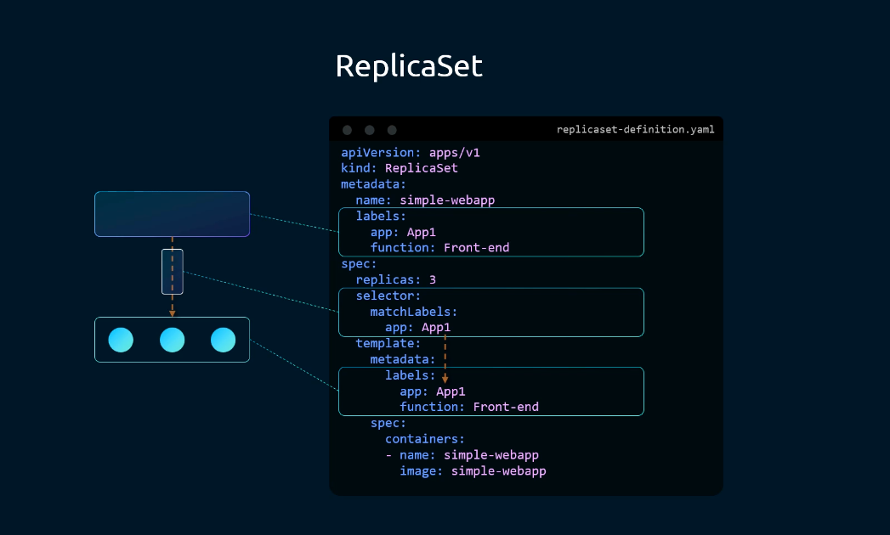

# Labels y Annotations



## Labels

Las **labels** (etiquetas) son pares clave-valor que se añaden a los objetos de Kubernetes (Pods, ReplicaSets, Deployments, Services, etc.) para identificarlos y organizarlos. Su función principal es permitir seleccionar y filtrar objetos mediante **selectors**.

### Definición en YAML

```yaml
metadata:
  name: simple-webapp
  labels:
    app: App1
    function: Front-end
```

Se pueden añadir tantas labels como se necesiten. No hay límite.

### ¿Para qué sirven?

- Agrupar objetos por entorno (`env: production`, `env: dev`)
- Agrupar por equipo, aplicación o capa (`tier: frontend`, `app: payments`)
- Permitir que ReplicaSets, Deployments y Services encuentren sus Pods mediante `selector`

### El selector y las labels

La relación entre un ReplicaSet y sus Pods se establece a través del `selector`. El ReplicaSet busca Pods cuyas labels coincidan con el `matchLabels` definido:

```yaml
# ReplicaSet
spec:
  replicas: 3
  selector:
    matchLabels:
      app: App1        # ← busca Pods con esta label
  template:
    metadata:
      labels:
        app: App1      # ← los Pods creados tendrán esta label
        function: Front-end
```

> Las labels del `selector` y las del `template.metadata.labels` deben coincidir, de lo contrario Kubernetes devolverá un error.

### ⚠️ Punto de confusión habitual

En la imagen se pueden ver **dos bloques de labels distintos** dentro del mismo YAML, y esto genera mucha confusión al principio:

```yaml
apiVersion: apps/v1
kind: ReplicaSet
metadata:
  name: simple-webapp
  labels:           # ← Labels del propio ReplicaSet
    app: App1
    function: Front-end
spec:
  replicas: 3
  selector:
    matchLabels:
      app: App1
  template:
    metadata:
      labels:       # ← Labels de los Pods que va a crear
        app: App1
        function: Front-end
```

Son dos cosas completamente distintas:

| Bloque | A quién pertenece | Para qué sirve |
|---|---|---|
| `metadata.labels` (nivel raíz) | Al **ReplicaSet** en sí | Identificar el RS con `kubectl get rs -l app=App1` |
| `template.metadata.labels` | A los **Pods** que crea el RS | Permitir que el `selector` del RS los encuentre |

**La clave:** el `selector.matchLabels` del RS debe coincidir con `template.metadata.labels`, no con `metadata.labels` del RS. Las labels del RS son independientes y opcionales; las del template son las que realmente gobiernan la relación RS → Pods.

### Filtrar con kubectl usando labels

```bash
# Listar Pods con una label concreta
kubectl get pods -l app=App1

# Listar Pods con varias labels (AND)
kubectl get pods -l app=App1,function=Front-end

# Listar cualquier tipo de objeto con una label
kubectl get all -l app=App1

# Ver las labels de todos los Pods
kubectl get pods --show-labels
```

---

## Annotations

Las **annotations** también son pares clave-valor, pero su propósito es diferente: sirven para almacenar **metadatos informativos** que no se usan para filtrar ni seleccionar objetos.

Se usan habitualmente para guardar información como la versión de la aplicación, el responsable del recurso, URLs de documentación, o datos usados por herramientas externas.

### Definición en YAML

```yaml
metadata:
  name: simple-webapp
  labels:
    app: App1
  annotations:
    buildVersion: "1.34"
    contact: "team-backend@empresa.com"
    description: "Frontend principal de la aplicación"
```

### Diferencia clave con las labels

| | Labels | Annotations |
|---|---|---|
| Uso principal | Seleccionar y filtrar objetos | Almacenar metadatos informativos |
| Usable en `selector` | Sí | No |
| Longitud del valor | Limitada | Puede ser extensa |
| Consultable con `-l` | Sí | No |
