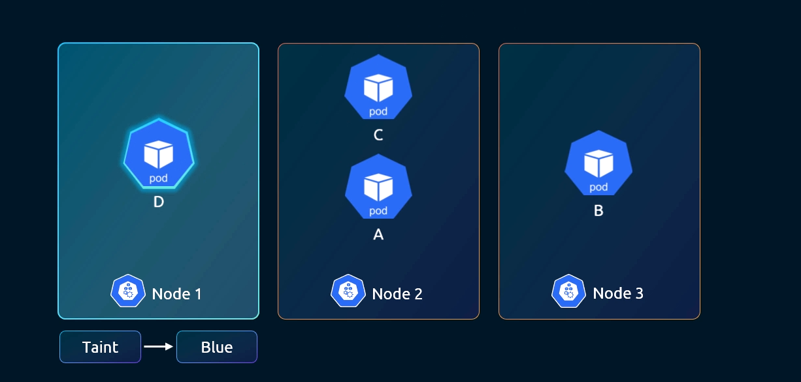

# Taints y Tolerations

## ¿Qué son los Taints y Tolerations?

Son un mecanismo que permite **controlar en qué nodos pueden ser schedulados los Pods**.

- Un **taint** se aplica a un **nodo** y actúa como una "repelencia". Es decir, impide que los Pods sean schedulados en ese nodo, a menos que el Pod lo tolere explícitamente.
- Una **toleration** se aplica a un **Pod** y le permite ser schedulado en nodos que tienen un taint concreto.

> Los taints y tolerations **no atraen** Pods a un nodo, solo controlan quién puede entrar. Para forzar que un Pod vaya a un nodo concreto se usa **Node Affinity**.

## Ejemplo práctico (imagen)



En la imagen hay tres nodos. 

El **Nodo 1** tiene un taint `Blue`. 

Solo el **Pod D** tiene una toleration para `Blue`, por lo que es el único que puede ser schedulado en el Nodo 1. 

Los Pods A, B y C no toleran ese taint y son enviados a los Nodos 2 y 3, que no tienen ningún taint.

```
Nodo 1  [taint: Blue]  →  solo admite Pod D
Nodo 2  [sin taint]    →  admite Pod C y Pod A
Nodo 3  [sin taint]    →  admite Pod B
```

> ⚠️ **Importante:** que el Pod D tenga una toleration para `Blue` **no significa que vaya a ir al Nodo 1**. La toleration solo le da permiso para entrar, pero el scheduler puede decidir igualmente colocarlo en el Nodo 2 o el Nodo 3, ya que no tienen taint y son nodos válidos. Si se quiere garantizar que un Pod acabe en un nodo concreto, hay que usar **Node Affinity** (ver siguiente apartado --> 11-node-affinity.md).

## Aplicar un Taint a un nodo

```bash
#Sintaxis
kubectl taint nodes <node-name> <key>=<value>:<effect>

# Ejemplo: aplicar taint Blue al Nodo 1
kubectl taint nodes node1 color=blue:NoSchedule
```

### Efectos disponibles

| Efecto | Comportamiento |
|---|---|
| `NoSchedule` | Los Pods sin toleration **no serán schedulados** en el nodo. Los ya existentes no se ven afectados |
| `PreferNoSchedule` | Kubernetes intentará **evitar** schedulear Pods sin toleration, pero no es garantía |
| `NoExecute` | Los Pods sin toleration no son schedulados **y los existentes son expulsados (evicted)** |

### Eliminar un taint

```bash
# Añadir un guión al final elimina el taint
kubectl taint nodes node1 color=blue:NoSchedule-
```

## Añadir una Toleration a un Pod

```yaml
apiVersion: v1
kind: Pod
metadata:
  name: pod-d
spec:
  containers:
    - name: nginx
      image: nginx
  tolerations:
    - key: "color"
      operator: "Equal"
      value: "blue"
      effect: "NoSchedule"
```

### Operadores

| Operador | Descripción |
|---|---|
| `Equal` | La key y el value deben coincidir exactamente |
| `Exists` | Solo comprueba que la key existe, sin importar el value |

## Taint en el nodo master

Por defecto, el nodo master tiene un taint que impide que los Pods de usuario sean schedulados en él:

```bash
kubectl describe node <master-node> | grep Taint
# Taints: node-role.kubernetes.io/control-plane:NoSchedule
```

Esto es lo que garantiza que los Pods de las aplicaciones solo van a los nodos worker.